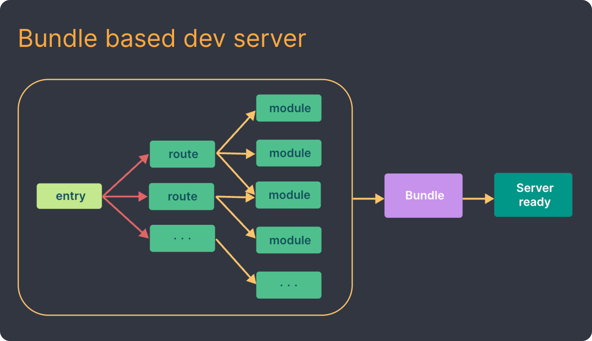
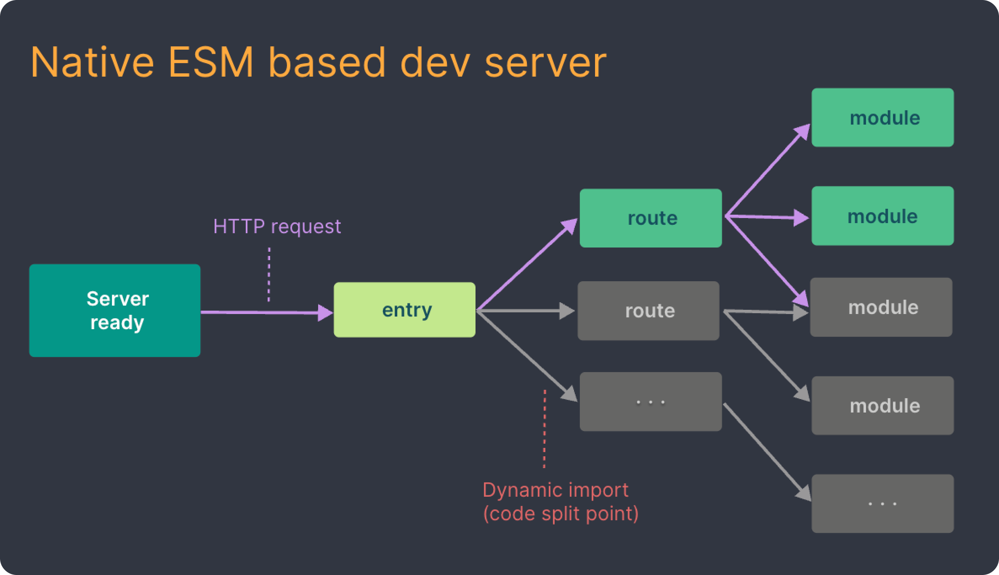

# FabricJS를 이용한 저작도구 개발

- 기간: 2023.12.19 ~ 2023.12.22 (<i> 4일 </i>)

## 프로젝트 환경
- Vite
- Vanilla
- Typescript

## 프로젝트 생성

### Vite

<i>프론트엔드 개발 툴</i>

> <b>기존 모듈 번들러</b> <i>(ex. webpack)</i> 
> 모든 소스코드 빌드 후 한번에 번들링 된 형태로 서비스 제공 
> 소스코드 업데이트 시에도 번들링 과정을 다시 거침으로 비효율적

<b>Go언어로 만든 ESBuild</b>를 통해 <b>사전 번들링</b>을 진행  ➡️ 기존 번들러 대비 10~100배 빠른 속도

<i>Native ESM</i>을 이용해 소스코드를 제공  ➡️ vite는 브라우저가 요청하는 대로 소스코드를 변환하고 제공 
<i>\* Navtive ESM: 브라우저의 자체적인 모듈 기능</i>

<figure class="half">
    
    
    <figcaption><i>출처: https://ko.vitejs.dev/guide/why.html</i></figcaption>
</figure>
