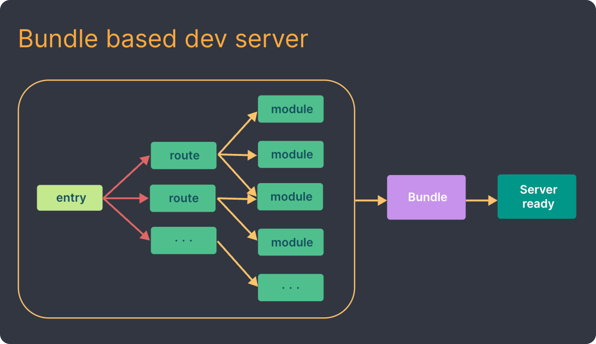
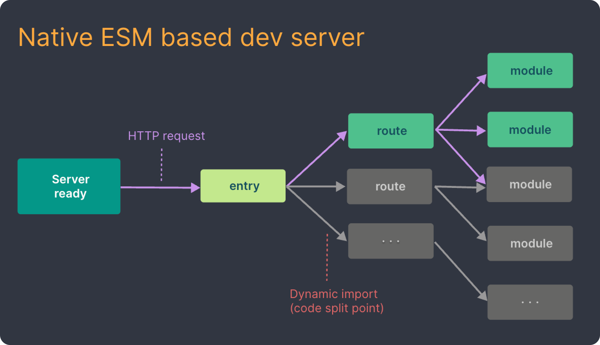

# FabricJS를 이용한 저작도구 개발

- 기간: 2024.01.02 ~ 2023.01.12 (<i> 9일 </i>)
- Vercel link: <a href="https://authoring-tool-tau.vercel.app/" target="_blank">링크</a>

## 프로젝트 생성

### Vite

<i>프론트엔드 개발 툴</i>

> <b>기존 모듈 번들러</b> <i>(ex. webpack)</i><br />
> 모든 소스코드 빌드 후 한번에 번들링 된 형태로 서비스 제공<br />
> 소스코드 업데이트 시에도 번들링 과정을 다시 거침으로 비효율적

<b>Go언어로 만든 ESBuild</b>를 통해 <b>사전 번들링</b>을 진행<br /> ➡️ 기존 번들러 대비 10~100배 빠른 속도

<i>Native ESM</i>을 이용해 소스코드를 제공<br /> ➡️ vite는 브라우저가 요청하는 대로 소스코드를 변환하고 제공<br />
<i>\* Navtive ESM: 브라우저의 자체적인 모듈 기능</i>

<figure class="half">
    
    
    <figcaption><i>출처: https://ko.vitejs.dev/guide/why.html</i></figcaption>
</figure>

## 사용 라이브러리

|                                                   Jotai                                                   |                                                                        FabricJS                                                                        |                                                          Styled-Components                                                           |
| :-------------------------------------------------------------------------------------------------------: | :----------------------------------------------------------------------------------------------------------------------------------------------------: | :----------------------------------------------------------------------------------------------------------------------------------: |
|  |  |  |

### Jotai

<i>리액트의 상태 관리 라이브러리</i>

<b>작은 단위의 상태(atom)</b>를 통하여 상태관리

보일러 플레이트 코드가 적어 리덕스 대비 <b>간편한 사용</b>이 가능.<br/>

#### 사용방법

```javascript
/** atom 생성 **/
export const numAtom = useAtom(0);

/** atom 사용 **/
const [num, setNum] = useAtom(numAtom); // 값, 업데이트 함수 사용
const num = useAtomValue(numAtom); // 값만 사용
const setNum = useSetAtom(numAtom); // 업데이트 함수만 사용
```
